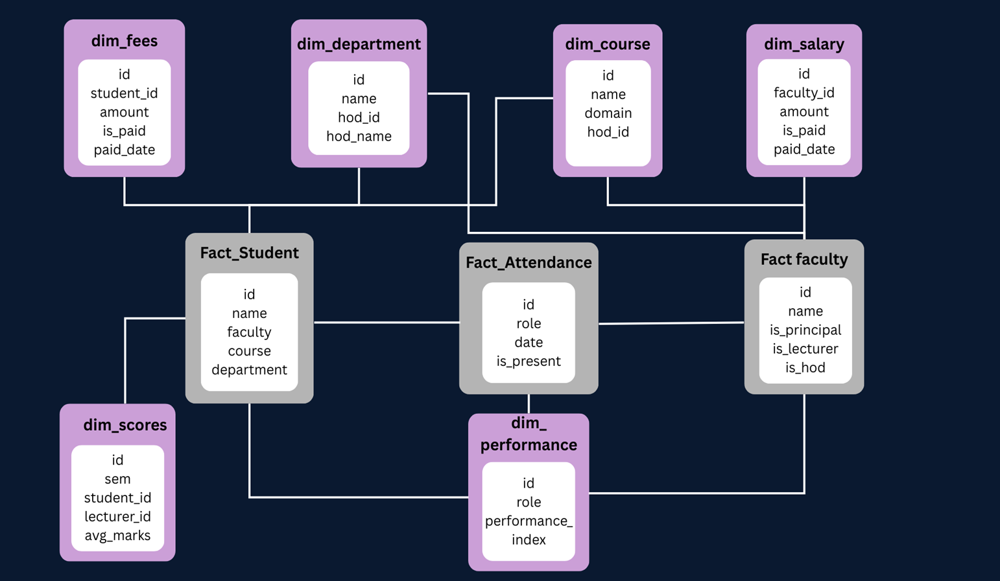

# Institution Management System (IMS)

An **Institution Management System** built with **FastAPI** and **Apache Airflow**, designed to manage the complete lifecycle of an educational institution — from student records and attendance tracking to analytics, ETL pipelines, and automated alerting.


## Overview

IMS is built on a **dual-database architecture**:

- **MySQL** — Operational (OLTP) database storing all live transactional data (students, faculty, attendance, fees, salaries, etc.)
- **PostgreSQL** — Analytical (OLAP) data warehouse housing dimensional tables and fact tables, used for reporting and analytics

An **Apache Airflow DAG** (`ims_daily_pipeline_v2`) runs daily to sync operational data into the warehouse, compute analytics, and deliver email pipeline status notifications.


---

## Tech Stack

| Component | Technology |
|---|---|
| **API Framework** | FastAPI |
| **ASGI Server** | Uvicorn |
| **ORM** | SQLAlchemy |
| **OLTP Database** | MySQL (via PyMySQL) |
| **OLAP Database** | PostgreSQL (via psycopg2) |
| **Workflow Orchestration** | Apache Airflow |
| **Authentication** | JWT |
| **Alerts** | SMTP Notifier |

---

## Architecture


## Project Structure

```
Institution Management System/
│
├── app/                         # FastAPI application
│   ├── main.py                  # App entry point
│   ├── database.py              # SQLAlchemy engines & sessions for MySQL and PostgreSQL
│   ├── airflow_integration.py   # Airflow DB connection bridge
│   │
│   ├── routers/                 # HTTP route handlers
│   │   ├── login.py
│   │   ├── students_route.py
│   │   ├── faculty_route.py
│   │   ├── course_route.py
│   │   ├── department_routes.py
│   │   ├── attendance_route.py
│   │   ├── announcements_route.py
│   │   ├── fees_route.py
│   │   ├── salary_route.py
│   │   ├── leave_req_route.py
│   │   ├── scores_route.py
│   │   ├── analytics_routes.py
│   │   ├── queries_route.py
│   │   ├── permissions_route.py
│   │   └── seed_data_route.py
│   │
│   ├── crud/                    # Business logic and database operations
│   │   ├── student_ops.py
│   │   ├── faculty_ops.py
│   │   ├── course_ops.py
│   │   ├── department_ops.py
│   │   ├── attendance_ops.py
│   │   ├── attendance_etl_ops.py
│   │   ├── dw_attendance_ops.py
│   │   ├── scores_ops.py
│   │   ├── fees_ops.py
│   │   ├── salary_ops.py
│   │   ├── leave_req_ops.py
│   │   ├── announcements_ops.py
│   │   ├── analytics_ops.py
│   │   ├── queries_ops.py
│   │   ├── permissions_ops.py
│   │   ├── golden_source_ops.py # ETL golden source logic
│   │   └── faker_data_generator.py # Test data generation
│   │
│   ├── schemas/                 # SQLAlchemy ORM models (MySQL + PostgreSQL tables)
│   │   ├── student.py
│   │   ├── faculty.py
│   │   ├── course.py
│   │   ├── departments.py
│   │   ├── student_attendance.py
│   │   ├── faculty_attendance.py
│   │   ├── fees.py
│   │   ├── salary.py
│   │   ├── scores.py
│   │   ├── leave_req.py
│   │   ├── announcements.py
│   │   ├── permissions.py
│   │   ├── queries.py
│   │   ├── golden_source.py
│   │   └── analytics.py
│   │
│   ├── models/                  # Pydantic response models
│   │   ├── student_response.py
│   │   ├── student_performance.py
│   │   ├── teacher_performance.py
│   │   ├── attendance_report.py
│   │   ├── revenue_report.py
│   │   └── data_response.py
│   │
│   └── exceptions/              # Custom exception classes
│
├── airflow/
│   ├── dags/
│   │   └── ims_dag.py           # Main Airflow DAG (1100+ lines)
│   └── airflow.cfg              # Airflow configuration
│
├── generated/                   # Auto-generated CSV files (scores, reports)
├── logs/                        # Application & ETL logs
├── .env                         # Environment variables (not committed)
├── requirements.txt             # Python dependencies
├── run.sh                       # Startup script for all services
└── log_filter.py                # Log filtering utility
```

---

## Features

### User & Role Management
- JWT-based authentication with role-based access control
- Roles: **Admin**, **Principal**, **HOD** (Head of Department), **Faculty**, **Student**
- Permission management with automatic admin initialization on startup

### Student Management
- Full CRUD for student records
- Course and lecturer assignment
- Year/batch tracking

### Faculty Management
- Faculty profiles with role flags: Principal, HOD, Lecturer
- Department and course assignments
- Salary management

### Academic Structure
- Department management with HOD assignments
- Course catalog with domain classification
- Cross-assignment between faculty, courses, and departments

### Attendance Tracking
- Daily attendance for both students and faculty
- Percentage-based reporting
- Historical attendance queries

### Scores & Assessments
- Semester-wise score tracking
- CSV-based bulk score ingestion
- Per-student and per-course performance analytics

### Financial Management
- Student fee tracking (monthly, with paid/unpaid status)
- Faculty salary generation and disbursement tracking
- Automated monthly salary record generation

### Announcements & Leave Requests
- Institution-wide announcements
- Leave request submission and management

### Analytics (OLAP / PostgreSQL)
- Student performance analytics
- Teacher performance scoring (attendance weight + student score weight)
- Attendance reports
- Revenue reports

### ETL Pipeline (Airflow)
- Daily automated sync from MySQL OLTP → PostgreSQL OLAP
- Golden source staging with snapshot batching
- Incremental extraction with watermark tracking
- Dimensional and fact table population

---

## Data Warehouse Schema(PostgreSQL)



---

## Airflow ETL Pipeline

### DAG: `ims_daily_pipeline_v2`

- **Schedule**: Daily (`@daily`)
- **Timezone**: Asia/Kolkata (IST)
- **Max Active Runs**: 1
- **Retries**: 2 (with 2-minute retry delay)

### Task Flow

| Task | Description |
|---|---|
| `gen_daily_attendance` | Generates daily attendance records for all students and faculty |
| `generate_salary` | Generates monthly salary records (only on the 1st of each month) |
| `stage_golden_source` | Incrementally extracts new/changed OLTP rows into MySQL golden staging tables |
| `create_golden_snapshot` | Persists the transient golden copy as a versioned snapshot batch |
| `etl_dimensions` | Loads PostgreSQL dimension tables from the current snapshot batch |
| `etl_facts` | Loads PostgreSQL fact tables from the current snapshot batch |
| `teacher_performance` | Computes teacher performance scores (40% attendance + 60% avg student score) |
| `finalize_golden_batch` | Advances watermarks and clears transient staging tables |

### Alerting

The pipeline sends **HTML email alerts** for:
- Pipeline success
- Pipeline failure (with root cause analysis)
- Individual task failures
- Task retries

---

## Setup & Installation

### Prerequisites

- Python 3.12+
- MySQL server (running and accessible)
- PostgreSQL server (running and accessible)
- pip

### 1. Clone the repository

```bash
git clone 
cd "Institution Management System"
```

### 2. Create a virtual environment

```bash
python3 -m venv IMS_venv
source IMS_venv/bin/activate
```

### 3. Install dependencies

```bash
pip install -r requirements.txt
```

### 4. Initialize Airflow

```bash
export AIRFLOW_HOME="$(pwd)/airflow"
airflow db migrate
airflow users create \
  --username admin \
  --firstname Admin \
  --lastname User \
  --role Admin \
  --email admin@example.com \
  --password admin
```

---

## Configuration

Create a `.env` file in the project root with the following variables:

```env
# MySQL (OLTP)
MYSQL_USER=your_mysql_user
MYSQL_PASSWORD=your_mysql_password
MYSQL_HOST=localhost
MYSQL_PORT=3306
MYSQL_DATABASE=ims_db

# PostgreSQL (OLAP)
POSTGRES_USER=your_pg_user
POSTGRES_PASSWORD=your_pg_password
POSTGRES_HOST=localhost
POSTGRES_PORT=5432
POSTGRES_DATABASE=ims_dw

# Admin credentials (auto-initialized on startup)
ADMIN_USERNAME=admin
ADMIN_PASSWORD=your_admin_password

# Email Alerting (for Airflow pipeline notifications)
from_email=your_email@gmail.com
to_email=alerts_recipient@example.com
ALERT_SMTP_HOST=smtp.gmail.com
ALERT_SMTP_PORT=587
ALERT_SMTP_USERNAME=your_email@gmail.com
ALERT_SMTP_PASSWORD=your_app_password
ALERT_SMTP_STARTTLS=true
ALERT_SMTP_SSL=false

# Optional: Airflow Webserver URL (for clickable log links in alert emails)
AIRFLOW_WEBSERVER_BASE_URL=http://localhost:8080

# Optional: OpenLineage
OPENLINEAGE_NAMESPACE=ims.airflow
OPENLINEAGE_PRODUCER=ims.airflow.error-lineage
```

---

## Running the Project

The easiest way to start all services is with the included startup script:

```bash
chmod +x run.sh
./run.sh
```

This starts all of the following in the background:
1. **Airflow API Server** → `http://localhost:8080`
2. **Airflow DAG Processor**
3. **Airflow Scheduler**
4. **FastAPI Server** → `http://localhost:8000`

Log files are written to the `logs/` directory.

Press `Ctrl+C` to gracefully stop all services.
